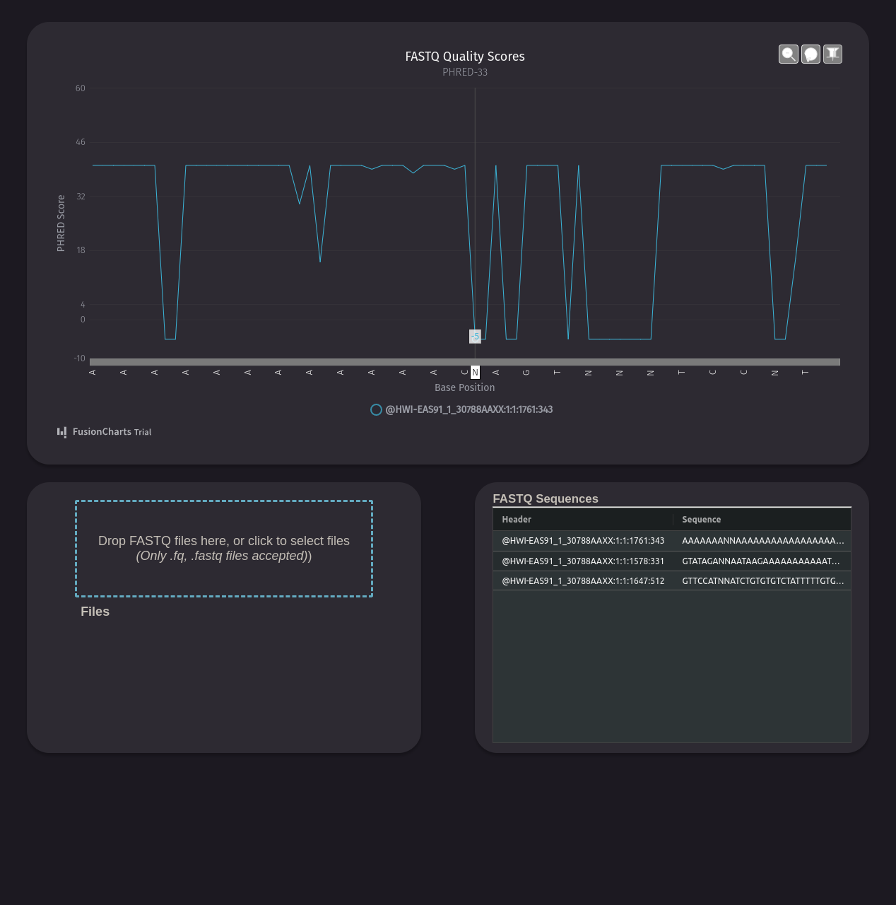

# DNA Quality Score Visualizer

Quickly render quality score trends in NGS and Nanopore sequencing.
This webapp normalizes variations of PHRED-format quality scores, which describe the error probability of an inaccurate DNA base read during sequencing.



## Prerequisites

- Python 3.7<
- NodeJS 8.17.0^ (install [nvm](https://github.com/nvm-sh/nvm) to manage legacy versions)

**FLASK API TODO: Frontend FASTQ data is stubbed.**

1. Enter a command line in root directory to start Flask:
  ```python run.py```  

2. Enter another command line in root directory to install Node dependencies & start React:  
  ```cd ./templates/static && nvm install 8```
  ```npm install && npm run watch```

3. Load the webapp at the IP address & port given by Flask
